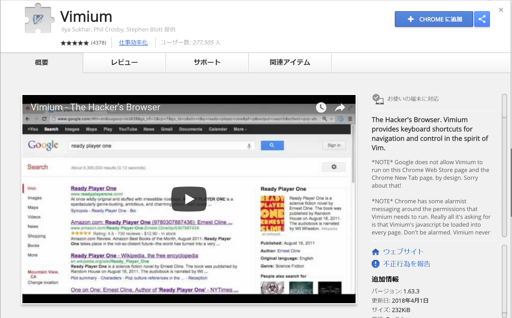
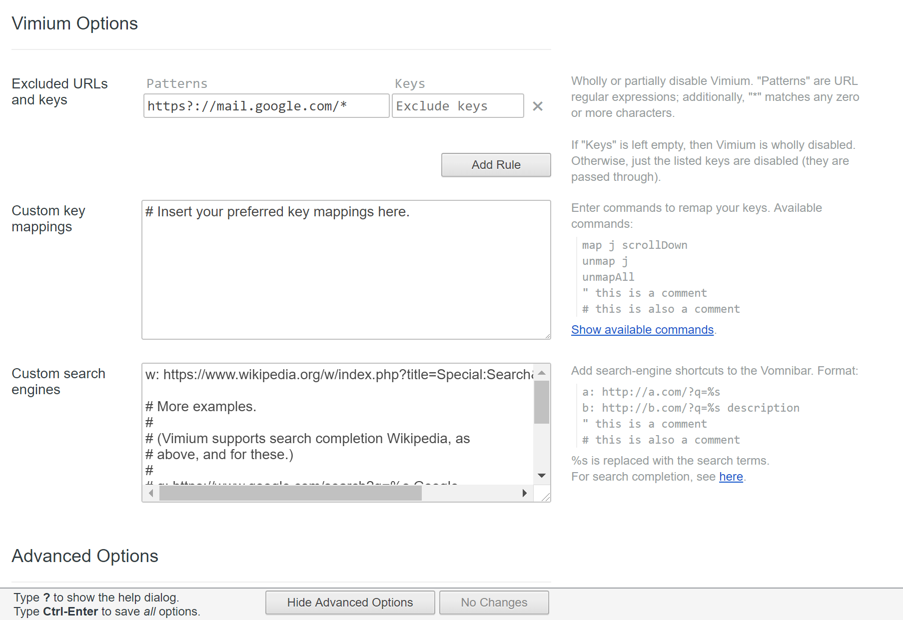
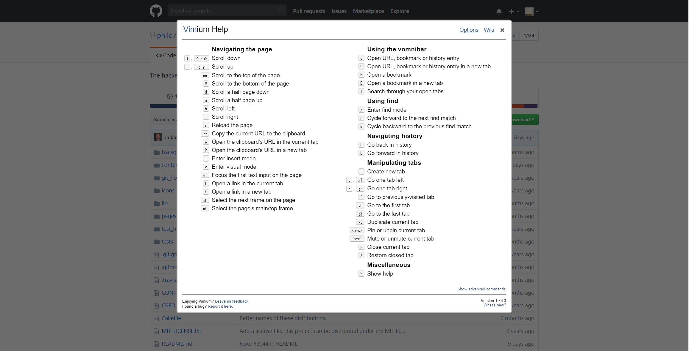
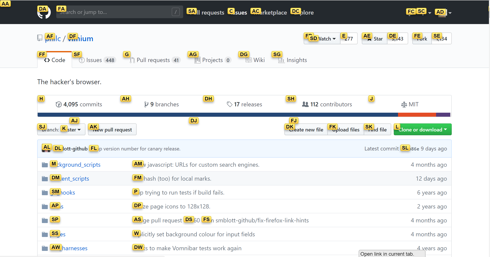
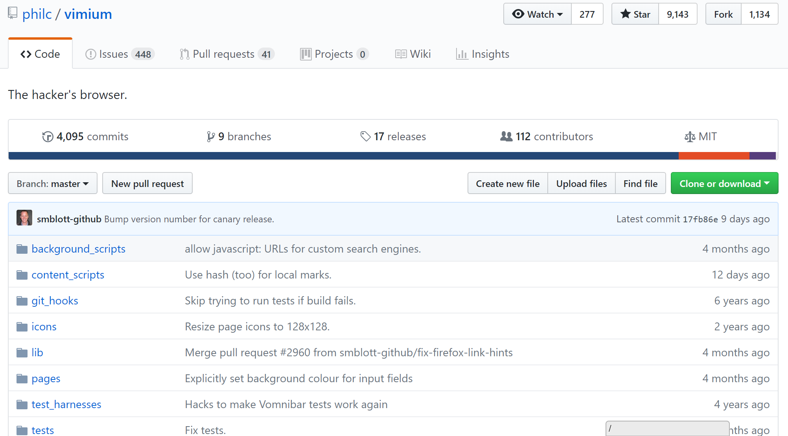
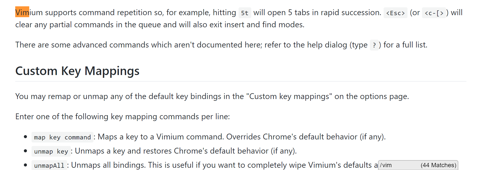

# 🔰vimiumさわってみた

vimに慣れ親しむ為の練習としてvimiumをさわってみた。

## 🔰そもそもvimiumって？

vimiumはchrome拡張機能の一種。この拡張機能を利用するとchromeをvimのように操作できるようになるみたいです。

[shortcutfoo - vim](https://www.shortcutfoo.com/app/dojos/vim)などで

たまにvimの操作も練習したりもしますが、webブラウジングのような普段遣いの操作でvimのような操作を練習すれば習得も早いのでは？　という思惑の元、

vimiunをさわってみます。

## 🔰公式サイトとかリポジトリとか

- [vimium](http://vimium.github.io/)
- [github - philc/vimium](https://github.com/philc/vimium)
- [chromeウェブストア - vimium](https://chrome.google.com/webstore/detail/vimium/dbepggeogbaibhgnhhndojpepiihcmeb)

## 🔰chromeに拡張機能vimiumをインストールしてみる

chromeウェブストアから拡張機能vimiumをインストールすればOK。

- [chromeウェブストア - vimium](https://chrome.google.com/webstore/detail/vimium/dbepggeogbaibhgnhhndojpepiihcmeb)からchromeに追加を実行すればOKです。

▶CHROMEに追加　からインストール  

## 🔰vimiumのオプションをみてみる

とりあえずvimium拡張機能のオプションを見てみる。

指定したURLだけvimiumの指定したキーをexcludedしたりキーマッピングをカスタムしたり色々できる様子。

ただ、ここらへんは基本操作ができない状態でいじりだしても……という感じなので基本、初期状態のままで使ってみます。

一度にスクロールする量の設定だけは好みに合わせて設定したほうがいい気がしたので、ここだけ変更しました。

## 🔰とりあえず公式のドキュメントを読む

- [philc/vimium - readme.me](https://github.com/philc/vimium/blob/master/README.md)
- [philc/vimium - wiki](https://github.com/philc/vimium/wiki)

リポジトリのwikiに結構細かい説明が書いてありますが、初級者が最初にここ読んでもまず使いこなせない気配がありあり。

とりあえず`?`をタイプするとvimiumのヘルプとしてキーマップが表示されるって事だけを理解してさわりはじめてみます。

## 🔰スクロールしてみる

vimの基本としてカーソル移動をkey操作で行いますが、vimiumだとスクロールしてくれるようです。

key  | description
:--- | :----------
h    | Scroll left
j    | Scroll down
k    | Scroll up
l    | Scroll righ

## 🔰pageupやpagedown

key  | description
:--- | :----------------------
u    | Scroll a half page up
d    | Scroll a half page down

`u`キーと`d`キーでページの半分だけスクロールしてくれるようです。

vimだと`d`や`u`は行を削除したり元に戻りしたりするようですがvimiumだとページスクロールになっているようです。

## 🔰トップやボトムにスクロール

key  | description
:--- | :-------------------------------
gg   | Scroll to the top of the page
G    | Scroll to the bottom of the page

`gg`のようにgキー(小文字)を2回押すとページヘッダにスクロールします。

`G`のようにGキー(大文字)を入力するとページボトムにスクロールします。

## 🔰現在のタブでリンクを開く/新しいタブでリンクを開く

key  | description
:--- | :-----------------------------
f    | Open a link in the current tab
F    | Open a link in a new tab

キーを押すと下記のようにリンクの上の文字が表示されます。

このときに、リンクに対応するキーを押すとリンクが表示されます。

## 🔰戻る　進む

key  | description
:--- | :-----------------------------
H    | go back in history
L    | go forward in history

`H`キー(大文字)・`L`キー(大文字)で前のページ、次のページへ移動できるようです。

## 🔰現在のタブを閉じる　最後に閉じたタブを開いてそのタブに移動する

key  | description
:--- | :-----------------------------
x    | Close current tab
X    | Restore closed tab

`x`キー(小文字)で現在のタブを閉じる。

`X`キー(大文字)で最後に閉じたタブを開いてそのタブに移動する。

vimだと文字削除なのでタブを閉じるに割り当てられているのですかね？

## 🔰表示しているページの文字列を検索する

key  | description
:--- | :-----------------------------
/    | enter find mode -- type your search query and hit enter to search, or Esc to cancel
n    | cycle forward to the next find match
N    | cycle backward to the previous find match

chromeを使っていると、`ctrl+f`で検索しちゃいがちですが、vimにならって`/`から文字列を検索していきます。

`/`キーを押すと右下にボックスが出てきます。

ためしにここにvimという文字列を入力すると、一致する文字列にフォーカスがあたり、一致する文字列の個数が表示されます。

このときにEnterを押して、`n`キー(小文字)を押すと、次に一致する文字列にフォーカスがあたります。

## 🔰総評

普段からvim likeな操作を行うことによって、vimの操作になれたり……するのか？

少し別物な気もしないでもないですけれども、hjklの操作とggとGを直感的に行えるくらいにはなれそうな気もする。

どうなんだろうか？
